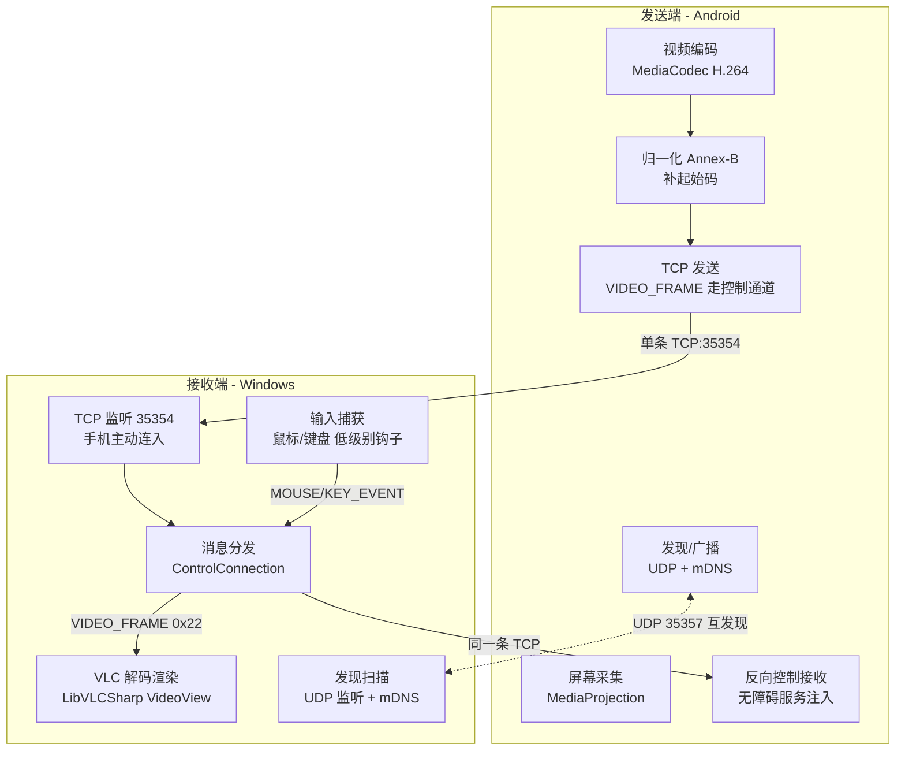

# 通用手机投屏软件 — 实现方案（VLC 方案 / 当前版本）

> 本文档描述项目**当前实际实现**，与代码保持一致。此前版本中描述的「三通道 TCP / ECDH 加密 / AAC 音频 / WiFi 直连 / 分辨率可选 / mDNS 为主」等内容已过时，详见文末「与早期设计的偏差」。

## 一、项目概述

### 1.1 目标

开发一款轻量投屏软件：手机屏幕实时镜像到 Windows 电脑，并支持**反向控制**（用电脑的鼠标/键盘操作手机）。

### 1.2 当前范围（Phase 1 实际落地）

| 维度 | 范围 |
|------|------|
| 发送端 | Android 8.0+（实测鸿蒙 6.0 / Huawei Mate 60 Pro 可用） |
| 接收端 | Windows 10/11（.NET 8 WPF） |
| 连接方式 | 局域网（WiFi）发现 + 手机主动 TCP 连接 |
| 核心功能 | 屏幕镜像（✅）+ 反向控制（✅，需手机开启无障碍服务） |
| UI | 极简界面，一键连接 |

### 1.3 已明确**未实现**（避免误判为已具备）

- ❌ 音频传输（AAC 编码类存在但未接入管线）
- ❌ 传输加密（明文 TCP，握手为占位空壳）
- ❌ WiFi 直连 P2P（仅局域网）
- ❌ 分辨率动态降采样（硬编码手机原生分辨率）
- ❌ PC 端主动连接手机（实际只能手机主动连 PC）
- ❌ 心跳保活（协议定义了但未发送）

---

## 二、系统架构

### 2.1 整体架构（单 TCP 复用）



### 2.2 关键设计点

- **单 TCP 通道**：视频帧（H.264 NAL，消息类型 `VIDEO_FRAME=0x22`）与控制消息（握手、心跳、反向控制事件等）**复用同一条 TCP 连接（端口 35354）**。不设独立的视频/音频端口。
- **解码渲染**：PC 端用 **LibVLCSharp**（VLC 内部硬解）直接消费 NAL 流，不再使用 FFmpeg / DirectX 自研管线。
- **连接方向**：**手机主动连 PC**。PC 端 `ConnectionManager` 监听 35354 等待手机连入；PC 端「设备列表 → 点击连接」的主动连接路径当前不可用（手机端不监听 TCP）。
- **发现**：以 **UDP 广播**为主（绕过鸿蒙 mDNS 不稳定的问题），mDNS 为辅。手机广播在线、PC 扫描获得 IP。

---

## 三、通信协议设计

> 完整规格见 `protocol/protocol-spec.md`。要点如下。

### 3.1 消息格式

```
字节偏移    字段          说明
─────────────────────────────────
[0]        Type          消息类型 (1 字节)
[1-4]      Length        负载长度 (4 字节, 大端 uint32, 最大 4MB)
[5-...]     Payload       消息体 (变长)
```

> 注意：长度字段为 **4 字节（uint32）**，非早期文档写的 2 字节。这是修复超大 I 帧溢出后改为 4 字节的。

### 3.2 视频传输

- 每个 `VIDEO_FRAME` 的 Payload 为一个 H.264 NAL 单元（Android 端已补 `00 00 00 01` Annex-B 起始码）。
- SPS/PPS 在编码格式变化时随首帧发送；PC 端 VLC 以 `demux=h264` 解封装。
- 当前**无分辨率降采样**，手机按原生分辨率（如 Mate 60 Pro 的 2688×1216）编码，码率约 4 Mbps。

### 3.3 反向控制消息

| 方向 | 消息类型 | 说明 |
|------|----------|------|
| PC → Phone | `MOUSE_EVENT` (0x0B) | 鼠标移动/按下/抬起（归一化坐标 ×10000） |
| PC → Phone | `KEY_EVENT` (0x02) | 键盘按下/抬起（Android KeyEvent 键码） |
| PC → Phone | `TOUCH_EVENT` (0x01) | 触摸事件（预留，当前 PC 主要发鼠标） |

---

## 四、技术选型

### 4.1 Android 端

| 模块 | 技术 | 说明 |
|------|------|------|
| 屏幕采集 | MediaProjection API | 系统录屏接口 |
| 视频编码 | MediaCodec (H.264) | 硬件编码，低延迟 |
| 后台保活 | PARTIAL_WAKE_LOCK + 前台服务通知 | 防鸿蒙后台冻结编码器线程 |
| 反向控制 | AccessibilityService + InputManager.injectInputEvent | 无障碍服务注入触摸/按键 |
| 网络 | TCP Socket（长连接，单通道） | 手机主动连 PC:35354 |
| 发现 | NsdManager(mDNS) + 自定义 UDP 广播 | UDP 为主、mDNS 为辅 |
| 语言/UI | Kotlin + Jetpack Compose | — |

### 4.2 Windows 端

| 模块 | 技术 | 说明 |
|------|------|------|
| UI | WPF (.NET 8) | 极简窗口 |
| 视频解码渲染 | **LibVLCSharp.WPF 3.9.3** + VideoLAN.LibVLC.Windows | VLC 内部硬解，低延迟（network-caching≈100ms） |
| 输入捕获 | Win32 低级别鼠标/键盘钩子 | 仅当鼠标位于投屏窗口上时转发 |
| 网络 | System.Net.Sockets | TCP 监听 35354 |
| 协议 | 手写二进制编解码（非 Protobuf） | `protocol/csharp` |

---

## 五、项目目录结构（当前）

```
Wifi投屏/
├── docs/
│   ├── 实现方案.md              # 本文档
│   └── 快速开始.md              # 使用指南
├── protocol/                     # 协议（手写二进制，非 Protobuf）
│   ├── csharp/                  #  C# 协议库 + 消息路由
│   ├── kotlin/                  #  Kotlin 协议库
│   └── protocol-spec.md         # 协议规格
├── server/                       # PC 接收端 (.NET 8 WPF)
│   └── src/
│       ├── core/                #  发现/连接管理
│       ├── modules/
│       │   ├── vlc-decoder/     #  VLC 解码 (NalStream + VlcDecoder)
│       │   ├── screen-mirror/   #  投屏插件(协议层空壳)
│       │   └── reverse-control/ #  反向控制(鼠标/键盘钩子)
│       ├── plugins/             #  插件管理器 + IPlugin
│       └── ui/                  #  MainWindow + MirrorWindow
├── client/android/               # Android 发送端
│   └── app/src/main/java/com/screenmirror/
│       ├── core/                #  ScreenCaptureService / DeviceDiscoveryService
│       ├── modules/             #  ReverseControlService(无障碍)
│       └── ui/                  #  MainActivity
└── build/                        # 构建工具(gradle 等，不含 scrcpy/ffmpeg)
```

---

## 六、核心模块详细设计

### 6.1 屏幕镜像模块

```
Android                                   Windows
ScreenCaptureService                       MirrorWindow
  └ MediaCodec(H.264)                       └ VlcDecoder(NalStream)
       │  normalizeToAnnexB                      │ StreamMediaInput
       │  VIDEO_FRAME(0x22) ──TCP──►             │ LibVLC 硬解
       │                                        │ VideoView 渲染
```

- Android 每编码出一个 NAL，包成 `VIDEO_FRAME` 经控制通道发送。
- PC `MirrorWindow` 订阅 `OnMessageReceived`，收到 `VIDEO_FRAME` 写入 `VlcDecoder`；`NalStream` 将 NAL 队列包装为 `Stream`，供 VLC 读取。
- **信号丢失检测**：`MirrorWindow` 每秒检测 NAL 计数，连续 3 秒无新增显示「信号丢失」，6 秒自动重置 VLC。

### 6.2 反向控制模块

```
Windows                                    Android
ReverseControlPlugin                       ReverseControlService
  └ 低级别鼠标/键盘钩子                       └ AccessibilityService
       │ 仅当鼠标在投屏窗口上                    │ 收到 MOUSE/KEY_EVENT
       │ 计算归一化坐标(WindowsToAndroid)        │ → 注入触摸/按键
       │ MOUSE/KEY_EVENT ──TCP──►               │   (GestureDescription / InputManager)
```

**PC 端要点**
- 钩子为**全局低级别钩子**，但只在「鼠标位于投屏窗口之上（或该窗口为前台）」时才转发，避免误控电脑本身。
- 坐标换算：`GetCursorPos` → 相对投屏窗口左上角 → `WindowsToAndroid(winX, winY, winW, winH)` 归一化（含屏幕旋转修正）→ 编码为归一化坐标 ×10000。
- 钩子必须在 **UI 线程（有消息循环）** 上安装，否则系统不会回调。

**Android 端要点**
- `MainActivity` 在 TCP 连上后设置 `ControlConnection.onMessage`，把 `MOUSE_EVENT/KEY_EVENT/TOUCH_EVENT` 路由到 `ReverseControlService`。
- `ReverseControlService` 是 `AccessibilityService`，用 `GestureDescription`（触摸）或 `InputManager.injectInputEvent`（按键）注入事件。
- **使用前必须在手机「无障碍设置」中开启 ScreenMirror**；否则 `getInstance()` 为 null，指令被忽略。

### 6.3 设备发现

```
手机 ──UDP 广播(35357)──► 电脑收到 → 显示设备(名称/IP)
手机主动 TCP 连 电脑:35354 → 握手 → 开始推流
```

- 手机 `DeviceDiscoveryService.startAdvertising(35354)` 注册 mDNS 并广播。
- 电脑 `DiscoveryService` 扫描 UDP + mDNS，获得设备后点「投屏」，手机端弹出 MediaProjection 授权，授权后建立 TCP 并推流。

---

## 七、已知限制与后续规划

### 7.1 当前限制（明确列出，避免误解）

1. **仅局域网**：不支持 WiFi 直连 P2P；手机与电脑需同一子网。
2. **无音频**：音频编码类存在但未接入，PC 端无音频解码。
3. **明文传输**：无加密，所有流量明文。
4. **无降分辨率**：大 I 帧占用单 TCP 带宽，复杂界面瞬时码率较高。
5. **反向控制需无障碍权限**：且鼠标须位于投屏窗口上才生效。
6. **PC 主动连接不可用**：只能手机主动连 PC。
7. **心跳未启用**：控制通道静默断线需靠 NAL 计数间接感知。

### 7.2 后续规划（未实现，按需排期）

- Phase 2：分辨率 720p/1080p 可选降采样、音频通道、传输加密（ECDH+AES）、心跳保活。
- Phase 3：iOS / macOS / 鸿蒙原生发送端、多设备同时投屏。

---

## 八、与早期设计的偏差（历史说明）

| 早期设计声称 | 当前实际 |
|--------------|----------|
| 三通道 TCP（视频/音频/控制分离端口） | 单 TCP 复用（视频走控制通道 0x22） |
| ECDH 密钥交换 + 配对码 + AES-128 | 明文，握手为占位空壳 |
| AAC 音频通道 | 无音频（编码类未接入） |
| WiFi 直连 P2P（GO 模式） | 仅局域网 UDP 发现 + 手机主动 TCP |
| 分辨率动态 720p/1080p 可选 | 硬编码全屏原生分辨率 |
| mDNS 发现为主 | UDP 广播为主、mDNS 为辅 |
| FFmpeg + DirectX 自研解码 | LibVLCSharp（VLC 内部解码） |
| scrcpy 嵌入方案 | 已废弃（鸿蒙不兼容 ADB），相关代码已清除 |

> 设计演进：FFmpeg 自研解码（不稳定）→ scrcpy（鸿蒙 HDC 不兼容 ADB 失败）→ **LibVLCSharp（当前）**。前两套方案的代码与依赖均已从项目清除。
